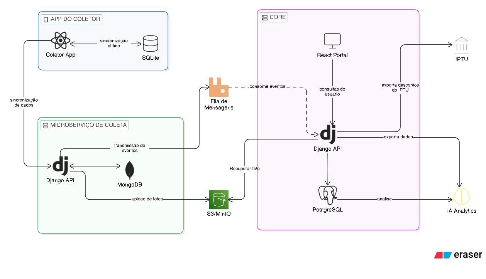

# Coleta Premiada - Core (Monolito)

## 📌 Propósito e Papel na Arquitetura
O **Core** é o coração do sistema Coleta Premiada. Desenvolvido como um monolito robusto, ele centraliza a gestão de usuários (Moradores, Leitores, Gestores, Supervisores), regras de negócio (programas de incentivo, cálculo de pontos e descontos de IPTU), e trilhas de auditoria para ações sensíveis.
Na arquitetura geral, o Core orquestra a comunicação entre o banco de dados principal, gerencia as requisições do Frontend e Mobile, e processa eventos assíncronos recebidos do microserviço de coletas (via RabbitMQ) para consolidar a pontuação de forma segura.

## 🏗️ Arquitetura de Serviços



### Diagrama Simplificado (ASCII)
```text
+-------------------+                    +-----------------------+
|  APP DO COLETOR   |                    |        CORE           |
|  (React Native)   |                    |    (React Portal)     |
|   [ SQLite ]      |                    +-----------+-----------+
+--------+----------+                                |
         | Sinc. Dados                               | Consultas
         v                                           v
+--------+----------+                    +-----------+-----------+
|   MS DE COLETA    |      Eventos       |     Core Backend      | ----> [ IPTU ]
|   (Django API)    | -----------------> |    (Django API)       |
|   [ MongoDB ]     |  (Fila Mensagens)  +-----------+-----------+ ----> [ IA Analytics ]
+--------+----------+                                |
         | Upload                            +-------+-------+
         v                                   |  PostgreSQL   | 
    [ S3 / MinIO ] <------------------------ +---------------+
                           Recuperar Foto
```

## 🛠️ Stack Tecnológica
- **Backend:** Python 3.12, Django 5.x, Django REST Framework
- **Banco de Dados:** PostgreSQL 16
- **Mensageria & Filas:** RabbitMQ, Celery
- **Armazenamento (Object Storage):** MinIO
- **Infraestrutura/Orquestração:** Docker, Docker Compose

## 📋 Pré-requisitos
- [Docker](https://docs.docker.com/engine/install/) e [Docker Compose](https://docs.docker.com/compose/install/) instalados
- [Git](https://git-scm.com/)

## 🚀 Instalação e Execução Local com Docker

1. **Clone este repositório:**
   ```bash
   git clone https://github.com/rangelro/Coleta-Premiada.git
   cd Coleta-Premiada
   ```

2. **Configure as Variáveis de Ambiente:**
   Copie o arquivo de exemplo e edite se necessário:
   ```bash
   cp .env.example .env
   ```

3. **Suba os containers:**
   ```bash
   docker compose up -d
   ```

4. **Execute as migrações do banco de dados (se não ocorrer automaticamente):**
   ```bash
   docker compose exec web python manage.py migrate
   ```

O painel de API e Admin estarão disponíveis em `http://localhost:8001`.

## ⚙️ Variáveis de Ambiente
O projeto exige a definição de variáveis no arquivo `.env`. Um modelo completo com as chaves necessárias está disponível no arquivo `.env.example` na raiz do projeto (inclui credenciais de DB, chaves JWT, e configurações do MinIO/RabbitMQ).

## 🧪 Como rodar os testes
Para executar a suíte de testes unitários e de integração dentro do container:

#TODO
```bash
docker compose exec web pytest
# ou utilizando o test runner do Django:
docker compose exec web python manage.py test
```

## 📚 Documentação Adicional
Consulte nossa Wiki para diagramas C4, ADRs (Architecture Decision Records) e processos detalhados:
👉 [Wiki do Projeto Coleta Premiada](https://github.com/rangelro/Coleta-Premiada/wiki)
