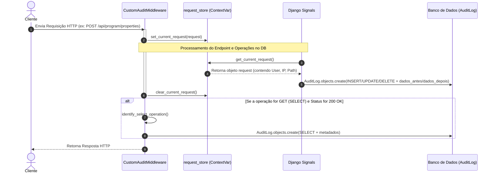

# Documentação Técnica: Sistema de Auditoria Customizada (`custom_audit`)

Este documento explica detalhadamente o funcionamento do novo sistema de auditoria customizada (`custom_audit`) implementado no projeto **Coleta Premiada**. Ele descreve **como funciona**, **o que foi alterado**, **como foi alterado** e **porque foi alterado**, trazendo explicações técnicas e claras sobre a arquitetura dessa nova funcionalidade.

---

## 1. Por que foi alterado? (Motivação)

Anteriormente, o sistema utilizava a biblioteca de terceiros `django-auditlog` para realizar o log de auditoria dos modelos no banco de dados. Embora ela atendesse a operações básicas de escrita (inserção, edição e exclusão), havia limitações significativas e necessidades de conformidade regulatória que exigiram a transição para uma solução sob medida:

1. **Auditoria de Operações de Leitura (SELECT)**:
   * A biblioteca `django-auditlog` **não oferece suporte** nativo para registrar acessos de leitura (operações `SELECT`).
   * Em sistemas de gestão pública e conformidade com a **LGPD (Lei Geral de Proteção de Dados)**, monitorar quem visualizou informações sensíveis (como perfis de usuários, registros de coletas e propriedades) é um requisito crucial de governança.
   * A nova auditoria customizada estende o monitoramento para capturar requisições `GET` em endpoints críticos da API.

2. **Acoplamento e Identificação do Usuário com JWT**:
   * O middleware padrão do `django-auditlog` é executado antes que as camadas de autenticação do Django REST Framework (DRF) decodifiquem o token JWT (SimpleJWT).
   * Isso frequentemente fazia com que as ações realizadas via API REST fossem salvas com usuário anônimo (`AnonymousUser`), dificultando a rastreabilidade.
   * O novo middleware foi programado especificamente para recuperar e autenticar manualmente o usuário via SimpleJWT caso a requisição ainda não tenha sido autenticada na camada HTTP inicial do Django.

3. **Independência de Dependências Externas (Footprint Leve)**:
   * A remoção do pacote `django-auditlog` simplifica o `requirements.txt` e elimina dependências externas que podem apresentar vulnerabilidades ou incompatibilidades com novas versões do Django.
   * A implementação customizada consome menos recursos e é direcionada unicamente para os modelos de interesse.

4. **Controle Fino sobre Serialização**:
   * O processo de serialização do estado do modelo antes/depois foi otimizado para evitar problemas de recursão infinita e serializar apenas os campos padrão (excluindo relações reversas complexas).

---

## 2. O que foi alterado?

A migração envolveu a substituição completa da biblioteca `django-auditlog` pelo novo app Django `custom_audit`. As seguintes modificações foram realizadas na base de código:

### A. Dependências
* **`core/requirements.txt`**: A biblioteca `django-auditlog==3.4.1` foi removida.

### B. Configuração Geral
* **`core/config/settings.py`**:
  * Removido `'auditlog'` e adicionado `'custom_audit'` em `INSTALLED_APPS`.
  * Removido `'auditlog.middleware.AuditlogMiddleware'` e adicionado `'custom_audit.middleware.CustomAuditMiddleware'` no array `MIDDLEWARE`.

### C. Modelos da Aplicação
* Removidas as linhas de importação `from auditlog.registry import auditlog` e os registros de model `auditlog.register(...)` nos seguintes arquivos:
  * [core/accounts/models.py](file:///home/rangel/INTEGRADOR/Coleta-Premiada/core/accounts/models.py) (`Usuario`, `Role`)
  * [core/collection/models.py](file:///home/rangel/INTEGRADOR/Coleta-Premiada/core/collection/models.py) (`RegistroColeta`, `Evidencia`, `Contestacao`)
  * [core/program/models.py](file:///home/rangel/INTEGRADOR/Coleta-Premiada/core/program/models.py) (`Programa`, `RegraPrograma`, `Imovel`, `SaldoPontos`, `Consolidacao`, `ConstantePontuacao`)

### D. Novo Módulo (`custom_audit`)
Criação do diretório `core/custom_audit/` contendo os seguintes arquivos:
* `models.py`: Define o modelo `AuditLog` no PostgreSQL (`audit_log`).
* `middleware.py`: Middleware para interceptar requisições HTTP, armazenar o contexto global da requisição e auditar operações `SELECT`.
* `request_store.py`: Armazena a requisição atual de forma thread-safe usando `contextvars`.
* `signals.py`: Define signals de banco de dados (`pre_save`, `post_save`, `post_delete`) para os principais modelos.
* `apps.py`: Inicializa o app e registra os signals ao iniciar o Django.
* `admin.py`: Configura o painel administrativo para visualização em modo somente leitura dos logs.

---

## 3. Como funciona a nova Auditoria? (Arquitetura e Fluxo)

A arquitetura do `custom_audit` atua em dois níveis: na **Camada de Transporte HTTP** (via middleware) e na **Camada de Banco de Dados** (via Django Signals). Para unificar essas duas camadas (saber qual requisição gerou qual query SQL), utiliza-se o mecanismo de `contextvars`.

### Fluxo de Funcionamento 



### Componentes Técnicos e suas Responsabilidades

#### 1. Persistência de Logs (`custom_audit/models.py`)
Os logs são gravados na tabela `audit_log` através do model `AuditLog`. Ele armazena:
* **`timestamp`**: Data e hora exata da ação.
* **`usuario_id` / `usuario_email`**: Identificadores do usuário responsável.
* **`operacao`**: O tipo de ação (`INSERT`, `UPDATE`, `DELETE`, `SELECT`).
* **`tabela`**: Nome da tabela física afetada (ex: `accounts_usuario`).
* **`objeto_id`**: O identificador (PK) do registro afetado.
* **`dados_antes` / `dados_depois`**: Campos serializados em formato JSON contendo o estado da linha no banco antes e depois da operação (útil para `UPDATE` e `DELETE`).
* **`ip_origem`**: IP do cliente que fez a requisição.
* **`endpoint`**: A URL da rota que disparou a alteração.

#### 2. Armazenamento de Contexto (`custom_audit/request_store.py`)
Como os Django Signals rodam diretamente nas transações de banco de dados, eles não possuem acesso nativo ao objeto `request` HTTP. Para resolver isso:
* Utilizamos o recurso `contextvars` do Python, que é thread-safe e seguro para contextos assíncronos.
* O middleware registra a requisição no início do ciclo HTTP e a remove no final (garantido por um bloco `finally`).
* Qualquer signal pode invocar `get_current_request()` a qualquer momento para buscar o usuário autenticado, IP de origem e rota HTTP.

#### 3. Auditoria de Leitura (SELECT) (`custom_audit/middleware.py`)
No middleware `CustomAuditMiddleware`, após a resposta ser processada com sucesso (`200 OK` a `299`), se o método for `GET`:
* O middleware mapeia a URL da requisição através de expressões regulares na função `identify_select_operation`.
* Se o endpoint mapear para a leitura de recursos críticos (ex: `accounts_usuario`, `program_imovel`, `program_programa` ou `collection_registrocoleta`), ele gera um registro no `AuditLog` marcando a operação como `SELECT`.
* **Resolução de Usuário JWT**: Se a autenticação clássica do Django não estiver populada, o middleware tenta instanciar o `JWTAuthentication` do DRF manualmente para extrair o usuário a partir do cabeçalho `Authorization: Bearer <token>`.

#### 4. Auditoria de Alterações (INSERT, UPDATE, DELETE) (`custom_audit/signals.py`)
Registra signals de banco de dados para os modelos monitorados (`Usuario`, `Imovel`, `Programa`, `RegistroColeta`, e opcionalmente `Coleta`):
* **`pre_save`**: Se o objeto já existe no banco (`instance.pk` não é nulo), realiza uma query rápida para buscar o estado atual no banco antes de salvar, serializando-o e guardando temporariamente na propriedade `_old_serialized` da instância.
* **`post_save`**: Registra uma operação de `INSERT` (se a instância acabou de ser criada) ou `UPDATE` (se já existia), salvando `dados_antes` (obtido do `_old_serialized`) e `dados_depois` (estado atual serializado).
* **`post_delete`**: Registra uma operação de `DELETE`, guardando o estado do registro que foi excluído como `dados_antes`.

---

## 4. Como foi alterado? (Exemplos de Código)

Abaixo estão os trechos centrais que demonstram como as operações são controladas.

### Middleware e Resolução JWT
No arquivo `core/custom_audit/middleware.py`:
```python
# Tenta resolver o usuário JWT caso request.user não tenha sido autenticado ainda (comum no DRF)
if not user or user.is_anonymous:
    try:
        from rest_framework_simplejwt.authentication import JWTAuthentication
        auth_result = JWTAuthentication().authenticate(request)
        if auth_result:
            user = auth_result[0]
    except Exception:
        pass
```

### Serialização de Modelos para JSON
No arquivo `core/custom_audit/signals.py`:
```python
def serialize_model(instance):
    data = {}
    for field in instance._meta.fields:
        if field.many_to_many or field.one_to_many:
            continue
        value = field.value_from_object(instance)
        try:
            data[field.name] = json.loads(json.dumps(value, cls=DjangoJSONEncoder))
        except Exception:
            data[field.name] = str(value)
    return data
```

### Interface de Administração Restritiva
No arquivo `core/custom_audit/admin.py`, o painel do `AuditLog` é totalmente protegido contra escritas diretas ou exclusões:
```python
@admin.register(AuditLog)
class AuditLogAdmin(admin.ModelAdmin):
    list_display = ('timestamp', 'operacao', 'tabela', 'objeto_id', 'usuario_email', 'ip_origem', 'endpoint')
    readonly_fields = ('timestamp', 'usuario_id', 'usuario_email', 'operacao', 'tabela', 'objeto_id', 'dados_antes', 'dados_depois', 'ip_origem', 'endpoint')

    def has_add_permission(self, request):
        return False

    def has_change_permission(self, request, obj=None):
        return False

    def has_delete_permission(self, request, obj=None):
        return False
```

