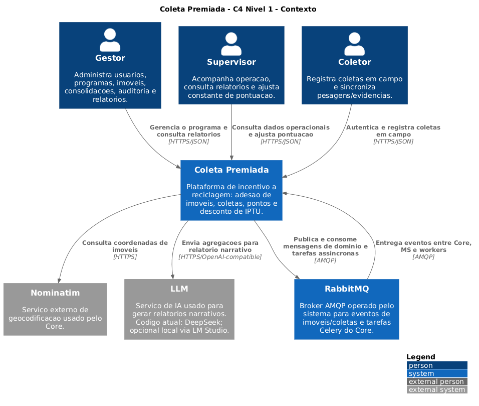
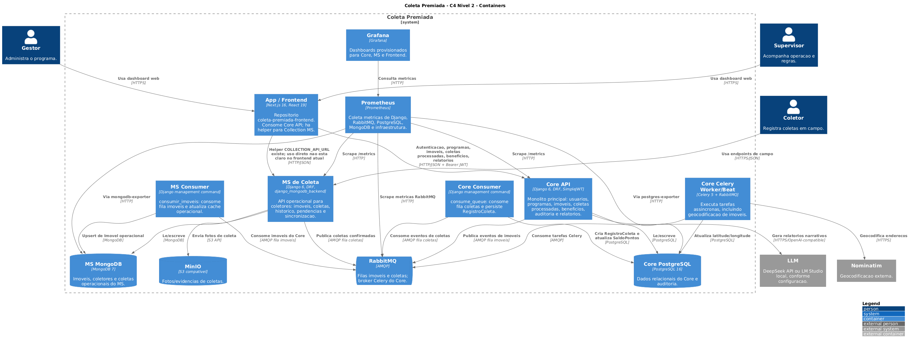
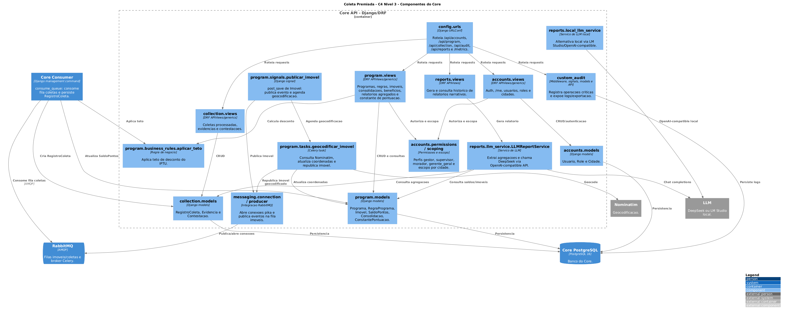
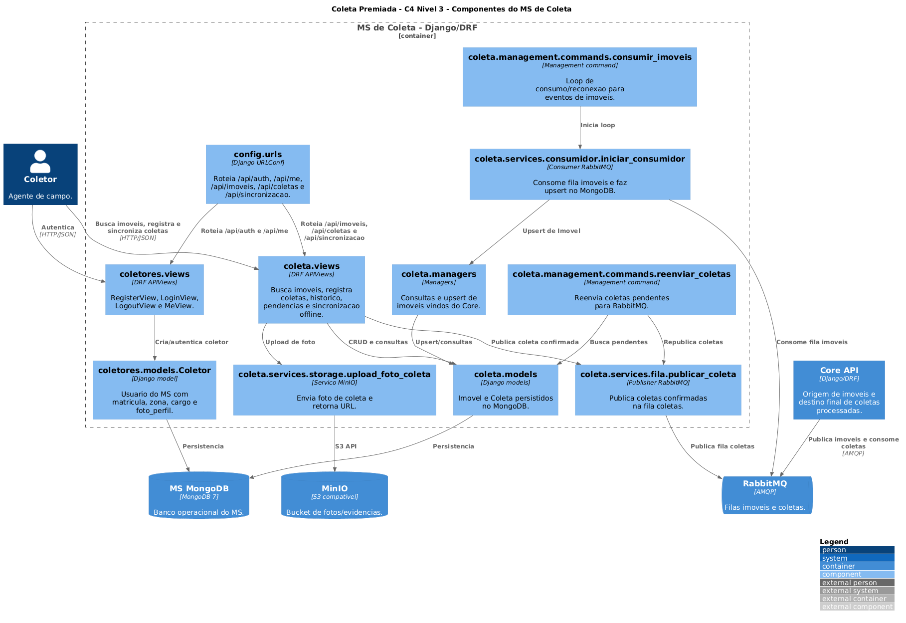

# Coleta Premiada - Wiki Completa

O **Coleta Premiada** é um ecossistema de incentivo à reciclagem. Moradores vinculam imóveis aos programas municipais, coletas geram pontos e esses pontos são convertidos em desconto no IPTU conforme as regras e os ciclos de cada programa.

> Documento consolidado em **14/07/2026**, com base no código, manifests e documentação dos quatro repositórios locais.

## Sumário

1. [Visão geral](#visão-geral)
2. [Escopo do sistema](#escopo-do-sistema)
3. [Projetos do ecossistema](#projetos-do-ecossistema)
4. [Atores e responsabilidades](#atores-e-responsabilidades)
5. [Fluxo principal](#fluxo-principal)
6. [Arquitetura e integrações](#arquitetura-e-integrações)
7. [Domínio e entidades](#domínio-e-entidades)
8. [APIs principais](#apis-principais)
9. [Funcionalidades e requisitos](#funcionalidades-e-requisitos)
10. [Diagramas](#diagramas)
11. [Auditoria](#auditoria)
12. [Monitoramento e alertas](#monitoramento-e-alertas)
13. [Backup e manutenção](#backup-e-manutenção)
14. [Execução local](#execução-local)
15. [Configuração](#configuração)
16. [Configurações padrão dos administradores](#configurações-padrão-dos-administradores)
17. [Pendências verificadas](#pendências-verificadas)

---

## Visão geral

| Repositório | Responsabilidade | Stack principal |
|---|---|---|
| `Coleta-Premiada` | Core, identidade, regras de negócio e integrações centrais | Django 6.0.4, DRF 3.17.1, PostgreSQL 16, Celery, RabbitMQ e MinIO |
| `cp-collection-ms` | Operação de campo e registro de coletas | Django 6.0.4, DRF 3.17.1, MongoDB 7, RabbitMQ compartilhado e MinIO |
| `coleta-premiada-frontend` | Portal web para moradores e perfis administrativos | Next.js 16.2.4, React 19.2.4, TypeScript 5 e Tailwind CSS 4 |
| `coleta-observability` | Métricas, dashboards e alertas | Prometheus, Grafana, Alertmanager, node-exporter e cAdvisor |

### Portas locais

| Recurso | URL/porta no host | Observação |
|---|---|---|
| Core API | `http://localhost:8001` | Container `core`, porta interna `8000` |
| MS de Coleta | `http://localhost:8002` | Container `ms`, porta interna `8001` |
| Frontend | `http://localhost:3000` | Portal Next.js |
| Grafana | `http://localhost:3001` | Porta interna `3000` |
| Prometheus | `http://localhost:9090` | Sem autenticação no compose atual |
| Alertmanager | `http://localhost:9093` | Recebe alertas do Prometheus |
| MinIO API | `http://localhost:9000` | Storage S3 compatível |
| MinIO Console | `http://localhost:9001` | Interface administrativa |
| RabbitMQ AMQP | `localhost:5672` | Broker único, fornecido pelo Core |
| RabbitMQ Management | Não publicado no host | Métricas internas em `rabbitmq:15692` |
| MongoDB do MS | `localhost:27019` | Porta interna `27017` |

---

## Escopo do sistema

### Objetivo

O sistema administra programas municipais de incentivo à reciclagem, desde a adesão do imóvel e o registro da coleta até o cálculo de pontos, a consolidação por ciclo e a concessão de desconto no IPTU. Também oferece rastreabilidade, relatórios e operação assistida por métricas e alertas.

### Dentro do escopo

- Cadastro e autenticação de Moradores, Gestores, Supervisores, Gestores Gerais e Coletores.
- Gestão de cidades, usuários, roles, programas, regras, ciclos e imóveis.
- Geocodificação de imóveis e réplica geoespacial para o MS.
- Busca de imóveis e registro online/offline de coletas em campo.
- Evidências fotográficas armazenadas em storage S3 compatível.
- Cálculo de pontos, saldos, benefícios e teto de desconto de 40%.
- Consolidação de ciclos e acompanhamento de descontos.
- Abertura e análise de contestações.
- Relatórios agregados e narrativos com LLM.
- Auditoria do Core e eventos operacionais do MS.
- Métricas, dashboards, alertas, backup e manutenção dos bancos.

### Fora do escopo

- Emissão oficial do carnê de IPTU ou integração direta com sistema tributário municipal.
- Aplicativo mobile versionado nos quatro repositórios analisados; o app Expo citado em documentos antigos não está neste conjunto.
- Orquestração Kubernetes, alta disponibilidade multi-nó e recuperação entre regiões.
- Data warehouse, data lake ou histórico analítico separado dos bancos operacionais.
- Provedor corporativo de identidade além de JWT e Google OAuth.

### Fronteiras por serviço

| Serviço | Limite de responsabilidade |
|---|---|
| Core | Fonte de verdade para identidade, programa, imóvel, pontuação, benefício, contestação e auditoria de negócio |
| MS de Coleta | Operação de campo, réplica de imóveis, coleta online/offline e publicação de eventos |
| Frontend | Interface web e gerenciamento da sessão do usuário; não executa regras de negócio centrais |
| Observabilidade | Coleta e visualização de métricas e roteamento de alertas; não altera dados de negócio |

---

## Projetos do ecossistema

### Estado consultado

| Repositório | Branch | Revisão consultada | Repositório remoto |
|---|---|---|---|
| `Coleta-Premiada` | `master` | `f63aad1` | <https://github.com/rangelro/Coleta-Premiada> |
| `cp-collection-ms` | `main` | `982603b` | <https://github.com/HeitorQueiroga49355/cp-collection-ms> |
| `coleta-premiada-frontend` | `main` | `b8de968` | <https://github.com/genzo-dev/coleta-premiada-frontend> |
| `coleta-observability` | `main` | `e68336c` | <https://github.com/HeitorQueiroga49355/coleta-observability> |

### Core - `Coleta-Premiada`

Responsabilidades:

- Autenticação JWT, Google OAuth, confirmação de e-mail, usuários, roles e cidades.
- Programas, regras de pontuação, ciclos, imóveis, saldos e consolidações.
- Publicação de imóveis e ingestão idempotente de coletas via RabbitMQ.
- Cálculo de pontos por peso e aplicação do teto de desconto.
- Evidências, contestações, relatórios agregados e relatórios narrativos.
- Auditoria, métricas, backup e manutenção do PostgreSQL.

Apps Django:

| App | Responsabilidade |
|---|---|
| `accounts` | Usuários, autenticação, roles, cidades e endpoints `/me` |
| `program` | Programas, regras, ciclos, imóveis, saldos e consolidações |
| `collection` | Coletas processadas, evidências e contestações |
| `reports` | Relatórios narrativos e histórico de geração |
| `messaging` | Conexão, produtores e consumidores RabbitMQ |
| `custom_audit` | Auditoria de escrita e leitura |

Serviços Docker:

- `core-db`
- `core`
- `core-celery`
- `core-celery-beat`
- `core-consumer`
- `rabbitmq`
- `minio`
- `postgres-exporter`
- `db-backup`
- `postgres-maintenance`

### Microserviço - `cp-collection-ms`

Responsabilidades:

- Autenticação de coletores por matrícula e senha.
- Réplica local e busca geoespacial de imóveis.
- Registro online e sincronização idempotente de coletas offline por `offline_id`.
- Upload opcional de foto para o MinIO.
- Publicação na fila `coletas` e consumo da fila `imoveis`.
- Auditoria operacional, backup, manutenção e métricas do MongoDB.

Serviços Docker:

- `ms-db`
- `ms`
- `ms-consumer`
- `mongo-backup`
- `mongo-maintenance`
- `mongodb-exporter`

O compose do MS **não sobe RabbitMQ próprio**. Ele usa o broker fornecido pelo Core através da rede `coleta-shared`.

### Portal - `coleta-premiada-frontend`

Responsabilidades:

- Cadastro, login, Google OAuth e confirmação de e-mail.
- Sessão JWT com access e refresh tokens em cookies HTTP-only.
- Jornadas de Morador, Gestor, Supervisor e Gestor Geral.
- Imóveis, coletas, programas, regras, ciclos, benefícios e contestações.
- Auditoria, usuários, roles, cidades e relatórios com IA.
- Métricas Prometheus no route handler `/api/metrics`.

Stack:

| Item | Versão |
|---|---|
| Next.js | 16.2.4, App Router |
| React | 19.2.4 |
| TypeScript | 5.x |
| Tailwind CSS | 4.x |
| shadcn | 4.10.0 |
| Recharts | 3.9.2 |
| React Hook Form | 7.77 |
| Zod | 4.4 |

O arquivo `proxy.ts`, convenção do Next.js 16, protege rotas, valida o access token e tenta renovar a sessão com o refresh token. Não existe `middleware.ts` no estado consultado.

### Observabilidade - `coleta-observability`

Componentes:

| Componente | Função |
|---|---|
| Prometheus | Coleta métricas e avalia regras de alerta |
| Grafana | Exibe dashboards provisionados |
| Alertmanager | Agrupa, silencia e encaminha alertas |
| node-exporter | Coleta métricas do host |
| cAdvisor | Coleta métricas dos containers |

Prometheus retém dados por 30 dias. O Alertmanager possui configuração para SMTP; Slack e ntfy aparecem como alternativas comentadas.

---

## Atores e responsabilidades

| Ator | Responsabilidade de negócio |
|---|---|
| Morador | Cadastra imóveis, acompanha pontos e benefícios e abre contestações |
| Gestor Geral | Gerencia cidades e supervisiona gestores em todas as cidades |
| Gestor | Configura programas e regras, executa consolidações e consulta auditoria |
| Supervisor | Acompanha a operação de campo e, no caso de uso definido, valida contestações |
| Coletor | Busca imóveis, registra coletas e anexa evidências no MS |

Na implementação atual, o PATCH de contestações exige `IsGestor`, permitindo Gestor e Gestor Geral, mas não Supervisor. Essa divergência está registrada em [Pendências verificadas](#pendências-verificadas).

---

## Fluxo principal

1. **Cadastro do imóvel:** o Core persiste `program.Imovel` no PostgreSQL por `/api/program/properties`.
2. **Geocodificação:** sem latitude/longitude, o Core agenda `program.tasks.geocodificar_imovel` no Celery; a task consulta Nominatim.
3. **Réplica Core -> MS:** um signal publica o imóvel na fila durável `imoveis`.
4. **Consumo no MS:** `python manage.py consumir_imoveis` faz upsert no MongoDB, incluindo localização GeoJSON.
5. **Registro em campo:** o Coletor usa `POST /api/coletas` ou `POST /api/sincronizar`.
6. **Evidência:** a foto opcional é enviada ao MinIO e sua URL é associada à coleta.
7. **Réplica MS -> Core:** o MS publica identificador, inscrição, peso e data na fila `coletas`.
8. **Ingestão no Core:** `core-consumer` executa `consume_queue`, evita duplicidade por `id_microservico` e resolve o imóvel pela inscrição.
9. **Pontuação:** `registrar_nova_coleta` calcula `peso_kg * pontos_por_kg`.
10. **Saldo:** com programa e ciclo abertos, o Core converte pontos em desconto e aplica o teto.
11. **Consolidação:** o Gestor chama `/api/program/consolidations/run`; o Core agrega coletas não consolidadas, aplica mínimo/teto, marca as coletas e fecha o ciclo.

### Filas

| Fila | Publicador | Consumidor | Conteúdo |
|---|---|---|---|
| `imoveis` | Core | `ms-consumer` | Cadastro/atualização de imóvel |
| `coletas` | MS | `core-consumer` | Coleta registrada em campo |

---

## Arquitetura e integrações

### Redes Docker

| Rede | Responsabilidade |
|---|---|
| `core-network` | Core e PostgreSQL |
| `storage-network` | Core e MinIO |
| `messaging-network` | Core, Celery, consumer e RabbitMQ |
| `coleta-shared` | Integração entre Core, RabbitMQ, MS e frontend |
| `coleta-observability` | Prometheus, aplicações e exporters |
| `ms-local-network` | MS e MongoDB |

### Integrações externas e internas

| Integração | Uso |
|---|---|
| RabbitMQ | Filas `imoveis` e `coletas` e broker Celery |
| MinIO | Fotos/evidências e backup offsite opcional |
| Nominatim | Geocodificação de imóveis pelo Core |
| DeepSeek | Relatórios narrativos remotos, modelo `deepseek-chat` |
| LM Studio | Alternativa local compatível com a API OpenAI |
| Prometheus | Coleta de métricas das aplicações e exporters |
| Grafana | Dashboards sobre dados do Prometheus |
| Alertmanager | Encaminhamento de alertas por SMTP e canais opcionais |

---

## Domínio e entidades

### Core

| Domínio | Entidades |
|---|---|
| Identidade | `Usuario`, `Role`, `Cidade` |
| Programas | `Programa`, `RegraPrograma`, `Ciclo`, `Imovel` |
| Benefícios | `SaldoPontos`, `Consolidacao`, `ConstantePontuacao` |
| Coletas | `RegistroColeta`, `Evidencia`, `Contestacao` |
| Relatórios | `RelatorioLLM` |
| Auditoria | `AuditLog` |

### Microserviço

| Entidade | Função |
|---|---|
| `Coletor` | Usuário operacional autenticado por matrícula |
| `Imovel` | Réplica do imóvel do Core com localização GeoJSON |
| `Coleta` | Registro de campo, status e sincronização |
| `EventoAuditoria` | Evento técnico/operacional persistido no MongoDB |

### Regra de pontuação

```text
pontuação = peso_kg × ConstantePontuacao.pontos_por_kg
novo_desconto = pontuação ÷ RegraPrograma.pontos_por_real
desconto_final = mínimo(desconto_acumulado, 40%)
```

O programa também define pontuação mínima para benefício e se permite acúmulo entre ciclos.

---

## APIs principais

### Core - `http://localhost:8001`

| Grupo | Endpoints principais |
|---|---|
| JWT | `/api/token`, `/api/token/refresh` |
| Autenticação | `/api/accounts/auth`, `/auth/me`, `/auth/logout`, `/auth/google` |
| Usuários e roles | `/api/accounts/users`, `/roles` |
| Cidades | `/api/accounts/cidades` |
| Portal do morador | `/api/accounts/me/history`, `/me/points`, `/me/benefits`, `/me/program` |
| Imóveis | `/api/program/properties` |
| Programas e regras | `/api/program/programs`, `/programs/{id}/rules` |
| Ciclos | `/api/program/cycles` |
| Consolidações | `/api/program/consolidations` e `/consolidations/run` |
| Benefícios | `/api/program/benefits` |
| Relatórios agregados | `/api/program/reports/*` |
| Constante | `/api/program/scoring-constant` |
| Coletas e evidências | `/api/collection/collections` e `/evidences` |
| Contestações | `/api/collection/disputes` |
| Relatórios narrativos | `/api/reports/generate`, `/history`, `/{id}` |
| Auditoria | `/api/audit/logs` e `/logs/export` |
| Métricas | `/metrics` |

### MS - `http://localhost:8002`

| Grupo | Endpoints principais |
|---|---|
| Autenticação | `/api/auth/register`, `/auth/login`, `/auth/logout`, `/api/me` |
| Imóveis | `/api/imoveis/buscar`, `/imoveis/proximos`, `/imoveis/{id}` |
| Coletas | `/api/coletas`, `/coletas/{id}`, `/coletas/historico`, `/coletas/pendentes`, `/coletas/morador` |
| Offline | `/api/sincronizar`, `/api/sincronizacao/status` |
| Auditoria | `/api/audit/eventos` |
| Métricas | `/metrics` |

---

## Funcionalidades e requisitos

### Requisitos funcionais

| ID | Requisito | Estado observado |
|---|---|---|
| RF01 | Cadastro, login e sessão | JWT, refresh rotativo, blacklist, Google OAuth e confirmação de e-mail no Core; JWT de Coletor no MS |
| RF02 | Perfis e escopo por cidade | Morador, Gestor, Supervisor e Gestor Geral; Gestor/Supervisor escopados por cidade |
| RF03 | Usuários, roles e cidades | Implementado no app `accounts` |
| RF04 | Programas, regras e ciclos | Implementado no app `program` |
| RF05 | Imóveis e geocodificação | Cadastro, signal RabbitMQ e task Celery/Nominatim |
| RF06 | Réplica de imóveis | Core publica; MS consome e mantém no MongoDB |
| RF07 | Busca operacional | Identificador, endereço e proximidade geoespacial |
| RF08 | Registro de coleta | Peso, observação e foto opcional |
| RF09 | Sincronização offline | Idempotência por `offline_id` e consulta de status |
| RF10 | Réplica de coletas | MS publica; Core registra por `id_microservico` |
| RF11 | Pontuação e benefícios | Cálculo por peso, constante, regra e teto de 40% |
| RF12 | Consolidação | Agregação por ciclo, mínimo, teto e fechamento |
| RF13 | Evidências e contestações | MinIO, models e endpoints no Core |
| RF14 | Relatórios | Participação, ciclo, ranking, impacto e narrativa LLM |
| RF15 | Auditoria | Core no PostgreSQL e eventos do MS no MongoDB |
| RF16 | Portal web | Rotas para os quatro perfis administrativos/cidadão |
| RF17 | Observabilidade | Métricas, dashboards, regras e Alertmanager |
| RF18 | Backup e manutenção | PostgreSQL e MongoDB com cron e retenção |

### Permissões relevantes

| Domínio | Leitura | Escrita |
|---|---|---|
| Cidades | Autenticados | Gestor Geral |
| Programas e regras | Autenticados | Gestor |
| Ciclos | Perfis administrativos | Gestor e Supervisor |
| Consolidação | Perfis administrativos | Gestor |
| Constante de pontuação | Autenticados | Gestor e Gestor Geral via `IsGestor` |
| Auditoria | Gestor e Gestor Geral | Somente consulta/exportação |
| Contestações | Morador vê as próprias; administrativos conforme cidade | Gestor e Gestor Geral via `IsGestor` |

### Requisitos não funcionais

| ID | Requisito | Implementação |
|---|---|---|
| RNF01 | Rastreabilidade | Audit log com usuário, operação, objeto, antes/depois, IP, endpoint e cidade |
| RNF02 | Observabilidade | Scrape a cada 15s, retenção de 30 dias, dashboards e Alertmanager |
| RNF03 | Resiliência | Filas duráveis, ACK/NACK, reconexão e idempotência |
| RNF04 | Segurança | JWT, cookies HTTP-only, perfis e escopo por cidade |
| RNF05 | Isolamento | Serviços separados em containers e redes Docker |
| RNF06 | Persistência especializada | PostgreSQL transacional e MongoDB geoespacial |
| RNF07 | Objetos | MinIO/S3 para evidências e backup opcional |
| RNF08 | Recuperação | Backups agendados e retenção configurável |
| RNF09 | Localização | PT-BR e timezone `America/Fortaleza` no Core |

---

## Diagramas

### Casos de uso


Fontes:

- `docs/functional_vision/diagramas/casos_de_uso.puml`
- `docs/functional_vision/diagramas/casos_de_uso.dot`
- `docs/functional_vision/diagramas/casos_de_uso.png`

### Diagrama de classes

O diagrama apresenta as entidades principais do Core e do MS, suas cardinalidades e as duas integrações assíncronas: réplica de imóveis e ingestão de coletas.


Fonte versionável:

- `docs/functional_vision/diagramas/diagrama_classes.dot`
- `docs/functional_vision/diagramas/diagrama_classes.png`

### Modelo C4

#### Contexto



#### Containers



#### Componentes do Core



#### Componentes do MS



Fontes PlantUML em `docs/architecture/c4/`.

### Regeneração dos diagramas auxiliares

```powershell
dot -Tpng -Gdpi=150 `
  -o docs/functional_vision/diagramas/casos_de_uso.png `
  docs/functional_vision/diagramas/casos_de_uso.dot

dot -Tpng -Gdpi=150 `
  -o docs/functional_vision/diagramas/diagrama_classes.png `
  docs/functional_vision/diagramas/diagrama_classes.dot
```

---

## Auditoria

### Core

O app `custom_audit` registra:

- `INSERT`, `UPDATE` e `DELETE` por signals.
- Leituras selecionadas como `SELECT` pelo middleware.
- Usuário, e-mail, operação, tabela, objeto, dados antes/depois, IP, endpoint, cidade e timestamp.

Endpoints:

```text
GET /api/audit/logs
GET /api/audit/logs/export?formato=csv
```

Filtros: `usuario_id`, `tabela`, `operacao`, `data_inicio`, `data_fim` e `objeto_id`.

### MS

O model `EventoAuditoria` registra origem, nível, evento, coletor, `offline_id`, fila, detalhes e timestamp no MongoDB.

Endpoint:

```text
GET /api/audit/eventos
```

A manutenção remove documentos antigos de `audit_logs` conforme `MONGO_RETENTION_DAYS`, cujo padrão é 90 dias.

---

## Monitoramento e alertas

### Targets Prometheus

| Job | Target configurado |
|---|---|
| Prometheus | `localhost:9090` |
| PostgreSQL | `postgres-exporter:9187` |
| MongoDB | `mongodb-exporter:9216` |
| Host | `node-exporter:9100` |
| Containers | `cadvisor:8080` |
| RabbitMQ | `rabbitmq:15692` |
| Core | `core:8000/metrics` |
| MS | `ms-dev:8001/metrics` |
| Frontend | `frontend:3001/metrics` - configuração atual incorreta |

O frontend escuta na porta interna `3000` e implementa `/api/metrics`. O job correto deve usar target `frontend:3000` e `metrics_path: /api/metrics`.

### Dashboards

- `coleta-premiada.json`
- `cp-collection-ms.json`
- `coleta-premiada-frontend.json`

### Alertas

As regras cobrem:

- Conexões, queries lentas, locks, deadlocks e cache do PostgreSQL.
- Disponibilidade, conexões, operações lentas e cache do MongoDB.
- Disco, previsão de esgotamento e targets indisponíveis.
- Filas acumuladas e ausência de consumidores no RabbitMQ.
- Indisponibilidade, respostas 5xx e memória do frontend.

Variáveis do Alertmanager/Grafana:

```env
GF_ADMIN_USER=admin
GF_ADMIN_PASSWORD=troque_esta_senha
SMTP_HOST=smtp.gmail.com:587
SMTP_FROM=seu_email@example.com
SMTP_USERNAME=seu_email@example.com
SMTP_PASSWORD=app_password
ALERT_EMAIL_TO=destino@example.com
```

---

## Backup e manutenção

### PostgreSQL

O serviço `db-backup` executa `pg_dump` em formato custom e usa o volume `backup-data`.

| Variável | Padrão |
|---|---|
| `CRON_SCHEDULE` | `0 2 * * *` |
| `BACKUP_KEEP_DAILY` | `7` |
| `BACKUP_KEEP_WEEKLY` | `4` |
| `BACKUP_WEEKLY_DAY` | `7` |

```bash
make db-backup
make db-restore FILE=/backups/postgres/daily/arquivo.dump
docker compose logs -f db-backup
```

### MongoDB

O serviço `mongo-backup` executa `mongodump`, comprime o resultado e usa o volume `mongo_backups`.

| Variável | Padrão |
|---|---|
| `CRON_SCHEDULE` | `0 3 * * *` |
| `BACKUP_RETENTION` | `7` |
| `MINIO_BACKUP_BUCKET` | `mongo-backups` |

```bash
docker exec coleta-mongo-backup /scripts/backup.sh
docker exec coleta-mongo-backup ls -lh /backups/mongo
docker exec -it coleta-mongo-backup /scripts/restore.sh
```

### Manutenção

| Repositório | Serviço | Rotinas |
|---|---|---|
| Core | `postgres-maintenance` | Limpeza de logs, VACUUM, REINDEX e relatório operacional |
| MS | `mongo-maintenance` | Limpeza em lote de auditoria e manutenção de índices |

---

## Execução local

### Ordem integrada

```bash
# 1. Cria a rede de observabilidade
cd ../coleta-observability
docker compose up -d

# 2. Sobe Core, RabbitMQ, MinIO e cria coleta-shared
cd ../Coleta-Premiada
docker compose up -d
make migrate

# 3. Sobe MS, MongoDB, consumer, backup e exporter
cd ../cp-collection-ms
docker compose up -d
make migrate

# 4. Sobe o portal web
cd ../coleta-premiada-frontend
docker compose up -d
```

### Comandos do Core

```bash
make up
make down
make logs
make build
make migrations
make migrate
make createsuperuser
make shell
make db-backup
make monitoring-up
```

### Comandos do MS

```bash
make up
make down
make logs
make migrate
make maintenance-cleanup
make maintenance-reindex
```

### Comandos do frontend

```bash
npm run dev
npm run build
npm run start
npm run lint
```

---

## Configuração

### Core

Variáveis principais:

- `DJANGO_SECRET_KEY`
- `DEBUG`
- `POSTGRES_*`
- `RABBITMQ_DEFAULT_USER`
- `RABBITMQ_DEFAULT_PASS`
- `RABBITMQ_HOST`
- `MINIO_ROOT_USER`
- `MINIO_ROOT_PASSWORD`
- `MINIO_ENDPOINT`
- `DEEPSEEK_API_KEY`
- `NOMINATIM_USER_AGENT`
- `CELERY_BROKER_URL`

### MS

- `DJANGO_SECRET_KEY`
- `CORE_JWT_SECRET_KEY`
- `MONGO_*`
- `RABBITMQ_*`
- `MINIO_*`
- `MONGO_RETENTION_DAYS`
- `MONGO_CLEANUP_BATCH`

### Frontend

- `CORE_API_URL`
- `COLLECTION_API_URL`
- `NEXT_PUBLIC_APP_URL`
- `NEXT_PUBLIC_GOOGLE_CLIENT_ID`
- `JWT_ACCESS_COOKIE_TTL`
- `JWT_REFRESH_COOKIE_TTL`

Nunca versionar `.env` com credenciais reais.

---

## Configurações padrão dos administradores

Os valores abaixo vêm dos arquivos `.env.example` e manifests consultados. São referências para ambiente local, não credenciais adequadas para produção.

### Perfis administrativos da aplicação

| Perfil | Escopo padrão | Responsabilidades |
|---|---|---|
| Gestor Geral | Todas as cidades | Gerenciar cidades, supervisionar gestores e consultar dados globais |
| Gestor | Cidade vinculada | Configurar programas/regras, consolidar ciclos, gerenciar usuários e consultar auditoria |
| Supervisor | Cidade vinculada | Acompanhar operação e administrar ciclos; a validação de contestações ainda diverge da permissão implementada |
| Django Superuser | Infraestrutura do Core | Acesso ao `/admin/` e manutenção técnica dos models |

Não existe usuário Django Admin versionado. O primeiro acesso deve ser criado explicitamente:

```bash
make createsuperuser
```

### Serviços administrativos

| Serviço | Usuário/configuração de exemplo | Senha/segredo de exemplo | Acesso |
|---|---|---|---|
| Django Admin | Nenhum usuário padrão | Definida no `createsuperuser` | `http://localhost:8001/admin/` |
| Grafana | `GF_ADMIN_USER=admin` | `GF_ADMIN_PASSWORD=troque_esta_senha` | `http://localhost:3001` |
| PostgreSQL | `POSTGRES_USER=postgres` | `POSTGRES_PASSWORD=troque_esta_senha` | Rede interna do Core |
| MongoDB | `MONGO_USER=coleta_user` | Definida no `.env` do MS | Host `27019`, interno `27017` |
| RabbitMQ | `RABBITMQ_DEFAULT_USER=guest` | `RABBITMQ_DEFAULT_PASS=troque_esta_senha` | AMQP `5672`; UI não publicada no host |
| MinIO | `MINIO_ROOT_USER=minio_admin` | `MINIO_ROOT_PASSWORD=troque_esta_senha` | Console `http://localhost:9001` |
| Prometheus | Sem autenticação | Não aplicável | `http://localhost:9090` |
| Alertmanager | Sem autenticação | SMTP configurado por variáveis | `http://localhost:9093` |

Todas as senhas marcadas com `troque_esta_senha`, `senha123`, `guest` ou `minioadmin` devem ser substituídas antes da inicialização de um ambiente compartilhado.

### Padrões operacionais

| Configuração | Valor padrão | Administração |
|---|---|---|
| Access token do Core | 8 horas | `SIMPLE_JWT` em `core/config/settings.py` |
| Refresh token do Core | 7 dias, com rotação e blacklist | `SIMPLE_JWT` |
| Timezone do Core | `America/Fortaleza` | `TIME_ZONE` |
| Idioma do Core | `pt-br` | `LANGUAGE_CODE` |
| Teto de desconto | 40% | `program.business_rules.DESCONTO_MAXIMO` |
| Retenção do Prometheus | 30 dias | Argumento `--storage.tsdb.retention.time` |
| Limpeza de auditoria | 90 dias | `LOG_RETENTION_DAYS` e `MONGO_RETENTION_DAYS` |
| Backup PostgreSQL | Diário às 02:00 | `CRON_SCHEDULE=0 2 * * *` no Core |
| Retenção PostgreSQL | 7 diários e 4 semanais | `BACKUP_KEEP_DAILY` e `BACKUP_KEEP_WEEKLY` |
| Backup MongoDB | Diário às 03:00 | `CRON_SCHEDULE=0 3 * * *` no MS |
| Retenção MongoDB | 7 arquivos | `BACKUP_RETENTION` |
| Agrupamento de alertas | Espera 10s, repetição 4h | `monitoring/alertmanager.yml` |

### Regras para produção

- Gerar chaves e senhas exclusivas com alta entropia.
- Definir `DEBUG=False` e restringir `ALLOWED_HOSTS`, CORS e CSRF aos domínios oficiais.
- Não publicar PostgreSQL, MongoDB, Prometheus ou Alertmanager diretamente na internet.
- Publicar consoles administrativos somente por HTTPS, autenticação e controle de rede.
- Manter contas pessoais; não compartilhar credenciais administrativas.
- Testar restauração de backup e entrega de alertas periodicamente.

---

## Pendências verificadas

### Prioridade alta

- **Possível dupla contabilização:** `registrar_nova_coleta` incrementa `SaldoPontos` durante a ingestão e `ConsolidacaoRunView` pode incrementar novamente usando as mesmas coletas.
- **Responsabilidade da contestação:** o caso de uso atribui validação ao Supervisor, mas o PATCH exige `IsGestor`; Supervisor recebe 403.
- **Scrape do frontend:** Prometheus usa `frontend:3001/metrics`, enquanto o container usa `3000` e expõe `/api/metrics`.
- **MinIO no MS:** `MINIO_ENDPOINT=localhost:9000` aponta para o próprio container, e o MinIO do Core não participa da rede `coleta-shared`.
- **Configuração de produção:** o Core usa fallback para `SECRET_KEY`, `DEBUG=True` por padrão e `ALLOWED_HOSTS=['*']`; esses valores precisam falhar de forma segura fora do ambiente local.

### Prioridade média

- O MS descarta mensagens inválidas com `nack(requeue=False)`, mas não existe Dead Letter Queue.
- O `.env.example` do frontend contém URLs/portas duplicadas e o alias antigo `coleta-ms-app:8001`; o serviço atual é `ms:8001`.
- As listas `CORS_ALLOWED_ORIGINS` e `CSRF_TRUSTED_ORIGINS` do Core ainda usam `http://localhost:3001`; o frontend atual publica em `http://localhost:3000`.
- O Core lê `DEEPSEEK_API_KEY`, mas a variável não aparece no `.env.example` consultado.
- O README do Core cita RabbitMQ Management em `15672`, mas o compose publica apenas `5672` no host.
- As imagens Docker com tag `latest` reduzem a reprodutibilidade.

### Testes e qualidade

- O Core não possui cobertura automatizada significativa nos `tests.py` dos apps.
- O MS possui scripts de integração, mas não uma suíte isolada abrangente.
- O frontend possui lint/build, sem comando de testes no `package.json`.
- O ecossistema ainda precisa de teste automatizado ponta a ponta cobrindo Core, filas, MS e frontend.

---

## Referências internas

- `README.md`
- `API_MAPPING.md`
- `ENDPOINTS.md`
- `docs/functional_vision/`
- `docs/development_vision/`
- `docs/architecture/c4/`
- `docs/functional_vision/diagramas/`
- `core/accounts/`
- `core/program/`
- `core/collection/`
- `core/reports/`
- `core/custom_audit/`
